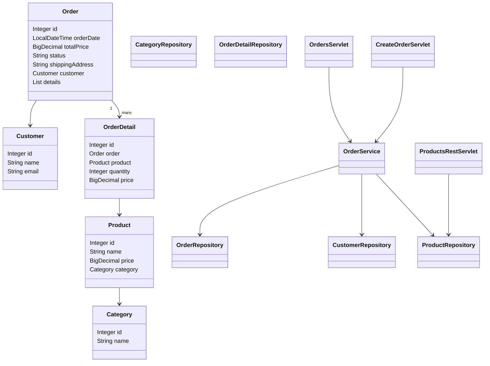

# Лабораторная работа №5

## Разработка и развертывание Web-приложений

---

## 📌 Описание проекта

Веб-приложение, реализованное с использованием:

* Java 17
* Hibernate ORM
* Jakarta Servlet
* Apache Tomcat 11
* Gradle
* Сборка в формате WAR

Приложение позволяет:

* Создавать заказы
* Просматривать список заказов
* Получать список продуктов через REST API
* Работать с базой данных через Hibernate

---

## 🏗 Архитектура проекта

Проект реализован по классической многослойной архитектуре:

* **Entity** — модели данных (JPA)
* **Repository** — слой доступа к данным
* **Service** — бизнес-логика
* **Web (Servlet)** — обработка HTTP-запросов
* **Config** — настройка Hibernate

---

## 📁 Структура проекта

```
src/main/java/
 ├── config/        # Конфигурация Hibernate
 ├── entity/        # Сущности JPA
 ├── repository/    # Репозитории (DAO)
 ├── service/       # Бизнес-логика
 └── web/           # Сервлеты

build.gradle.kts    # Конфигурация Gradle
```

---

## ⚙️ Используемые технологии

* Hibernate (SessionFactory)
* Jakarta Persistence (JPA)
* Jakarta Servlet API
* Apache Tomcat 11
* Gradle

---

## 🚀 Сборка проекта

В корне проекта выполнить:

```bash
gradlew clean build
```

После сборки WAR-файл будет создан в:

```
build/libs/
```

---

## 🚀 Развёртывание в Tomcat

1. Скопировать созданный `.war` файл в папку:

```
C:\tomcat11\webapps
```

2. Запустить Tomcat:

```bash
C:\tomcat11\bin\catalina.bat run
```

3. Открыть в браузере:

```
http://localhost:8080/product-table-war/
```

---

## 🌐 Доступные URL

### Список заказов

```
/product-table-war/orders
```

### Создание заказа

```
/product-table-war/create-order
```

### REST API продуктов

```
/product-table-war/api/products
```

---

## 🛠 Особенности реализации

* `Order.id` использует
  `@GeneratedValue(strategy = GenerationType.IDENTITY)`
* Для избежания `LazyInitializationException` используется
  `FetchType.EAGER`
* В репозиториях используется `merge()` вместо `persist()`
* Управление транзакциями выполняется вручную
* Проект собирается в WAR и разворачивается на Tomcat

---

# 📊 UML-диаграмма классов



---

## 🎓 Результат

В ходе выполнения лабораторной работы были реализованы:

* Подключение Hibernate к базе данных
* Работа с сущностями JPA
* CRUD-операции через репозитории
* Сервлеты для обработки HTTP-запросов
* Сборка WAR-файла
* Развёртывание приложения на Apache Tomcat

Проект успешно собирается и корректно работает на Tomcat 11.

---
